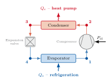

# Cycle

`Cycle` models a single-stage vapour-compression refrigeration / heat-pump cycle consisting of a compressor, an expansion valve and two heat exchangers (condenser and evaporator), exchanging heat with two secondary fluids. Given an operating point defined by the evaporation temperature $T_\mathrm{e}$, a condensation temperature $T_\mathrm{c}$, a superheat $\Delta T_{\mathrm{sh}}$ and a subcooling $\Delta T_{\mathrm{sc}}$, it solves the four states of the cycle and calculates the duties, compressor power and coefficients of performance (COP).

## The cycle states

States are numbered in the direction of refrigerant flow:

| State | Location                                    | Description                    |
| ----- | -------------------------------------------- | ------------------------------- |
| 1     | Compressor inlet / evaporator outlet         | Low pressure superheated gas         |
| 2     | Compressor outlet / condenser inlet          |  High pressure superheated gas       |
| 3     | Condenser outlet / expansion-valve inlet     | High pressure subcooled liquid                |
| 4     | Expansion-valve outlet / evaporator inlet    | Low pressure two-phase liquid/vapour mixture |

{ width="600" }

- **1 → 2** Compression, governed by the compressor model
- **2 → 3** Condensation, calculated from the operating point
  subcooled liquid region.
- **3 → 4** Expansion, isenthalpic for EffCompressor, given by PolynomialCompressor.
- **4 → 1** Evaporation, calculated from the operating point.

For each state, the following variables are calculated:

- $T$ : temperature
- $p$ : pressure
- $h$ : specific enthalpy
- $s$ : specific entropy
- $\rho$ : density

## Saturation pressures

$T_\mathrm{e}$ and $T_\mathrm{c}$ define the two operating pressures in the cycle:

$$
p_\mathrm{e} = p_{\mathrm{sat}}(T_\mathrm{e}), \qquad p_\mathrm{c} = p_{\mathrm{sat}}(T_\mathrm{c})
$$

## State 1 - compressor inlet

The suction state is superheated vapour at $p_\mathrm{e}$, $\Delta T_{\mathrm{sh}}$ above $T_\mathrm{e}$:

$$
T_1 = T_\mathrm{e} + \Delta T_{\mathrm{sh}}, \qquad p_1 = p_\mathrm{e}
$$

With $T_1$ and $p_1$ all other state variables are fully defined.

## State 2 - compressor outlet

The discharge state is calculated from the compressor model

## State 3 - condenser outlet

The refrigerant rejects heat at constant pressure $p_c$ and leaves the
condenser as a subcooled liquid, $\Delta T_{\mathrm{sc}}$ below the condensing temperature:

$$
T_3 = T_\mathrm{c} - \Delta T_{\mathrm{sc}}, \qquad p_3 = p_\mathrm{c}
$$

When $\Delta T_{\mathrm{sc}}$ is approximately zero (1e-4 tolerance), state 3 sits exactly on the bubble line then the state is defined by the temperature and vapour quality $Q=0$ instead of temperature and pressure, since a
$(p, T)$ do not uniquely define the state of a two-phase fluid.

## State 4 - evaporator inlet

The expansion valve is adiabatic is modelled as an **isenthalpic** expansion:

$$
p_4 = p_\mathrm{e}, \qquad h_4 = h_3
$$

which fixes state 4 in the two-phase region once $h_4$ and $p_4$ are known. For a
[`PolynomialCompressor`](polynomial_compressor.md), $h_4$ is instead derived from the
polynomial cooling capacity $\dot Q_{\mathrm{ref}}$ so that the state stays consistent with the
manufacturer rating data the polynomials are fitted to:

$$
h_4 = h_1 - \frac{\dot Q_{\mathrm{ref}}}{\dot m}
$$

This is only *approximately* isenthalpic. The difference is the error introduced by
using two independently curve-fitted polynomials (cooling capacity and mass flow) rather
than a single consistent equation of state.

## Duties, power and COP

With all four states known, the condenser and evaporator duties follow from steady-flow
energy balances across each heat exchanger:

$$
Q_{\mathrm{c}} = \dot m \,(h_2 - h_3), \qquad Q_{\mathrm{e}} = \dot m \,(h_1 - h_4)
$$

For `PolynomialCompressor` these are calculated from the polynomial for the cooling capacity.

i.e. the heat rejected in the condenser and the heat absorbed in the evaporator. (For a
 these two duties come directly from the compressor's polynomials
instead, for the same rating-data-consistency reason as state 4 above.) Together with the
compressor power $P_{\mathrm{el}}$ these give the heating and cooling coefficients of
performance:

$$
COP_{\mathrm{heat}} = \frac{Q_{\mathrm{c}}}{P_{\mathrm{el}}}, \qquad COP_{\mathrm{cool}} = \frac{Q_{\mathrm{e}}}{P_{\mathrm{el}}}
$$

## Coupling to heat exchangers

The heat exchanger models are evaluated after all states are calculated. The cycle is evaluated for an operating point not necessarily for a set of boundary conditions. Check the documentation of the `PlateHeatExchanger` as well as `PlateHeatExchangerCycleOptimizer`. Boundary conditions at the secondary inlets of the heat exchangers can be used to determine an optimal operating point, which can then be used to solve the cycle.