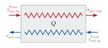
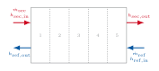
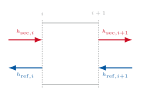

# Plate heat exchanger

`PlateHeatExchanger` models a chevron plate heat exchanger. The physical model is taken from Tryfon C. Roumpedakis course Thermodynamics Software taught at NTUA Athens during winter semester 2026. The calculation steps are described below:

# Parametrization:

`PlateHeatExchanger` takes its plate geometry through a single `geom` dictionary passed
to the constructor. The following keys are required:

| Key                  | Symbol   | Description                                                  | Unit |
| --------------------- | -------- | -------------------------------------------------------------- | ---- |
| `chevron_angle_rad`   | $2\phi$  | Full corrugation (chevron) inclination angle against the main flow direction | rad  |
| `plate_amplitude_m`   | $a$      | Corrugation amplitude, i.e. half the gap between two adjacent plates | m    |
| `corrugation_pitch_m` | $L$      | Corrugation pitch (wavelength of the corrugation pattern)      | m    |
| `plate_thickness_m`   | $t$      | Plate wall thickness                                            | m    |
| `Bp`                  | $B_{\mathrm{p}}$    | Width of the heat-transfer surface of a plate                   | m    |
| `Lp`                  | $L_{\mathrm{p}}$    | Height (length) of the heat-transfer surface of a plate         | m    |
| `Dp`                  | $D_{\mathrm{p}}$    | Port (inlet/outlet nozzle) diameter                             | m    |
| `Nt`                  | $N_{\mathrm{t}}$    | Number of plates in the pack                                   | -    |
| `Ntmin`               | $N_{\mathrm{t,min}}$ | Smallest plate count considered when searching for a design (used by [`determine_min_n_plates`](../api.md)) | -    |
| `Ntmax`               | $N_{\mathrm{t,max}}$ | Largest plate count considered when searching for a design     | -    |

The remaining constructor arguments are not part of the plate geometry and are passed
separately, each with a default value:

| Argument       | Symbol                              | Description                                                              | Default    |
| -------------- | ------------------------------------ | -------------------------------------------------------------------------- | ---------- |
| `Rf_ref`       | $R_{\mathrm{f,ref}}$                | Fouling thermal resistance on the refrigerant side [m²K/W]       | `0.0001`   |
| `Rf_sec`       | $R_{\mathrm{f,sec}}$                | Fouling thermal resistance on the secondary side [m²K/W]                   | `0.00003`  |
| `num_elements` | -                                    | Number of finite elements used to discretize the plate                     | `10`       |
| `Ft`           | -                                    | Correction factor applied to the logarithmic mean temperature difference   | `1.0`      |
| `l_w`          | $\lambda_{\mathrm{w}}$              | Thermal conductivity of the plate material [W/mK]                          | `20`       |
| `dp_ref_max`   | $\Delta p_{\mathrm{ref,max}}$       | Maximum allowed pressure drop on the refrigerant side [Pa]                 | `2e4`      |
| `dp_sec_max`   | $\Delta p_{\mathrm{sec,max}}$       | Maximum allowed pressure drop on the secondary side [Pa]                   | `2e4`      |
| `dT_pinch`     | $\Delta T_{\mathrm{pinch}}$         | Minimum allowed temperature difference between the streams (pinch) [K]     | `2`        |
| `feas_tol`     | -                                    | Relative tolerance by which each feasibility limit is relaxed              | `1e-6`     |

See the [API reference](../api.md) for the full constructor signature.

## Derived plate geometry quantities

The corrugation is characterized by its amplitude $a$ and pitch $L$, giving a dimensionless wave number and a surface enlargement factor (ratio of corrugated to flat plate area):

$$
X = \frac{2\pi a}{L}, \qquad
\Phi = \frac16\left(1 + \sqrt{1+X^2} + 4\sqrt{1+\tfrac12 X^2}\right)
$$

These allow us to determine the effective heat transfer area per plate, hydraulic diameter and flow channel area between two plates:

$$
A_{\mathrm{p}} = \Phi\, B_{\mathrm{p}} L_{\mathrm{p}}, \qquad D_{\mathrm{h}} = \frac{4a}{\Phi}, \qquad A_{\mathrm{ch}} = 2a\,B_{\mathrm{p}}
$$

where $B_{\mathrm{p}}$ and $L_{\mathrm{p}}$ are the plate width and height. With $N_{\mathrm{t}}$ plates in the heat exchanger, and $N_{\mathrm{cp}} = (N_{\mathrm{t}}-1)/2$ channel passes (at least one). The total heat transfer area is $A_{\mathrm{available}} = N_{\mathrm{t}} A_{\mathrm{p}}$.

## Determining boundary states

{ width="600" }

We expect the inlet and outlet state of the refrigerant ($h_\mathrm{ref,in}, h_\mathrm{ref,out}$) to be known, as well as the inlet state of the secondary fluid ($h_\mathrm{sec,in}$). In addition, both mass flow rates are known ($\dot m_{\mathrm{ref}}, \dot m_{\mathrm{sec}}$).
We now want to determine the outlet enthalpy of the secondary fluid $h_{\mathrm{sec, out}}$.
We first need to calculate the heat duty:

$$
Q = \dot m_{\mathrm{ref}} \,(h_{\mathrm{ref,in}} - h_{\mathrm{ref,out}})
$$

The secondary fluid receives or supplies exactly that duty. For the secondary outlet we use the conservation of energy to get:

$$
h_{\mathrm{sec,out}} = h_{\mathrm{sec,in}} + \frac{Q}{\dot m_{\mathrm{sec}}}
$$

$Q$ is positive when the refrigerant releases heat (condenser, $h_{\mathrm{ref,in}} >
h_{\mathrm{ref,out}}$) and negative when it absorbs heat (evaporator). The base class uses
the same sign to set `state` to `"cond"` or `"evap"`. The secondary fluid heats up when $Q>0$ (condenser) and cools down when $Q<0$ (evaporator).

## Discretization

Each plate is split into `num_elements` finite elements along the flow direction. Element
boundaries are placed on the saturation points (bubble/dew enthalpy) as different phases require different equations. The number of elements given to the superheated, two-phase and subcooled
regions is proportional to each region's share of the total refrigerant enthalpy change.

{ width="600"}

The secondary stream's node enthalpies are determined through an energy balance:
$$
 h_{\mathrm{sec},i+1} = h_{\mathrm{sec},i} + \frac{\dot{m}_{\mathrm{ref}}}{\dot{m}_{\mathrm{sec}}} \Delta h_{\mathrm{ref},i}
 $$
## Per-element solution

{ width="600"}

For every element the mean stream temperatures are evaluated at the element's mean
enthalpy, the plate (wall) temperature is estimated as the mean of the two stream
temperatures, and each film temperature as the mean of its stream and the plate:

$$
T_{\mathrm{plate}} = \tfrac12(T_{\mathrm{ref}}+T_{\mathrm{sec}}), \qquad
T_{\mathrm{w,ref}} = \tfrac12(T_{\mathrm{ref}}+T_{\mathrm{plate}}), \qquad
T_{\mathrm{w,sec}} = \tfrac12(T_{\mathrm{sec}}+T_{\mathrm{plate}})
$$

### Pinch temperature
To get the pinch temperature of each element $\Delta T_{\mathrm{pinch},i}$ we simply take the minimum temperature difference at the elements boundaries and in its center. The overall pinch temperature is
$\Delta T_{\mathrm{pinch}} = \mathrm{min}(\Delta T_{\mathrm{pinch},i})$.

### Heat transfer correlations
We can then determine the heat transfer coefficients for each fluid ($\alpha_{\mathrm{ref}}, \alpha_{\mathrm{sec}}$) through correlations depending on the  fluids phases:

- **Single phase** (superheated gas or subcooled liquid on the refrigerant side, and
    always on the secondary side). Correlation for the Nusselt number:

    $$
    Nu = 0.122\, Pr^{1/3}(\mu/\mu_{\mathrm{w}})^{1/6}(\xi\, Re^2 \sin 2\phi)^{0.374}
    $$

    with a Darcy friction factor $\xi$:

    $$
    \frac{1}{\sqrt{\xi}} =\frac{\cos(\varphi)}{\sqrt{0.18 \tan(\varphi)+ 0.36 \sin(\varphi) + \frac{\xi_0}{\cos(\varphi)}}}+\frac{1-\cos(\varphi)}{\sqrt{3.8 \xi_1}}
    $$

    with

    $$
    \xi_0 =
    \begin{cases}
    \dfrac{64}{Re}, & Re < 2000 \\[4pt]
    (1.8 \log(Re)-1.5)^{-2}, & Re \geq 2000
    \end{cases}
    $$

    $$
    \xi_1 =
    \begin{cases}
    \dfrac{597}{Re}+3.85, & Re < 2000 \\[4pt]
    \dfrac{39}{Re^{0.289}}, & Re\geq 2000
    \end{cases}
    $$

    and

    $$
    Re = \frac{G_{\mathrm{ch}} D_{\mathrm{h}}}{\mu}, \quad
    Pr = \frac{c_{\mathrm{p}}\, \mu}{\lambda_{\mathrm{h}}}, \quad
    G_{\mathrm{ch}} = \frac{\dot m}{N_{\mathrm{cp}} A_{\mathrm{ch}}}
    $$

- **Condensation** (refrigerant side only, phase-1 elements while `state == "cond"`):
    Nusselt number from the correlation of Shah, evaluated at saturated-liquid properties
    and modulated by the local vapour quality $x$ and the reduced pressure:

    $$
    Nu = 0.023\, Re_{\mathrm{L}}^{0.8}\, Pr_{\mathrm{L}}^{0.4}
    \left[(1-x)^{0.8} + \frac{3.8\, x^{0.76}(1-x)^{0.04}}{p_{\mathrm{red}}^{0.38}}\right]
    $$

    with the Reynolds and Prandtl numbers evaluated for saturated liquid (subscript $L$),
    and the reduced pressure:

    $$
    Re_{\mathrm{L}} = \frac{G_{\mathrm{ch}}\, D_{\mathrm{h}}}{\mu_{\mathrm{L}}}, \qquad
    Pr_{\mathrm{L}} = \frac{c_{\mathrm{p,L}}\, \mu_{\mathrm{L}}}{\lambda_{\mathrm{L}}}, \qquad
    p_{\mathrm{red}} = \frac{p}{p_{\mathrm{crit}}}
    $$

    and $G_{\mathrm{ch}}$ as above.

- **Evaporation** (refrigerant side only, phase-1 elements while `state == "evap"`):
    Nusselt number from the correlation of Yan and Lin, based on the all-liquid Reynolds
    number and an equivalent boiling number:

    $$
    Nu = 19.26\, Re_{\mathrm{L}}^{0.5}\, Bo_{\mathrm{eq}}^{0.3}\, Pr_{\mathrm{L}}^{1/3}
    $$

    again with $Re_{\mathrm{L}}$ and $Pr_{\mathrm{L}}$ evaluated for saturated liquid. The equivalent boiling
    number is built from the mean heat flux over the full installed plate area (not the
    local element flux) and an equivalent, all-liquid-equivalent mass velocity:

    $$
    Bo_{\mathrm{eq}} = \frac{q}{G_{\mathrm{ch,eq}}\, h_{\mathrm{fg}}}, \qquad
    G_{\mathrm{ch,eq}} = G_{\mathrm{ch}}\left[1 - x + x\sqrt{\tfrac{\rho_{\mathrm{L}}}{\rho_{\mathrm{g}}}}\right]
    $$

    with $h_{\mathrm{fg}} = h_{\mathrm{g}} - h_{\mathrm{l}}$

From the Nusselt numbers when can then determine the heat transfer coefficients:

$$
\alpha_{\mathrm{ref}} = \frac{Nu_{\mathrm{ref}}\, \lambda_{\mathrm{L}}}{D_{\mathrm{h}}}, \qquad
\alpha_{\mathrm{sec}} = \frac{Nu_{\mathrm{sec}}\, \lambda_{\mathrm{L}}}{D_{\mathrm{h}}}
$$

$$
U = \frac{1}{\frac{1}{\alpha_{\mathrm{ref}}} + \frac{1}{\alpha_{\mathrm{sec}}} + R_{\mathrm{f,ref}} + R_{\mathrm{f,sec}} + \frac{t}{\lambda_{\mathrm{w}}}}
$$

($t$ = plate thickness, $\lambda_{\mathrm{w}}$ = plate thermal conductivity, `l_w`). With the
element's duty $ Q_i = \dot m_{\mathrm{ref}}\,\Delta h_i$ and its (`Ft`-corrected, counter-flow)
logarithmic mean temperature difference $\Delta T_{\mathrm{m},i}$, the area required to transfer
that duty at that local coefficient is

$$
A_i = \frac{Q_i}{U_i\,\Delta T_{\mathrm{m},i}}
$$

The overall required heat transfer area is:

$$
A_{\mathrm{phex}} = \sum_{i}^{n_\mathrm{el}}A_i
$$

## Pressure drop

The pressure drop of a stream through the exchanger is the sum of a port (nozzle) and a
plate-friction contribution:

$$
\Delta p = \Delta p_{\mathrm{pt}} + \Delta p_{\mathrm{pl}}
$$

**Port pressure drop**, from Kumar's correlation, is a fixed multiple of the port
velocity head:

$$
\Delta p_{\mathrm{pt}} = 1.3 \cdot \tfrac12\, G_{\mathrm{pt}}^2\, v_{\mathrm{in}}, \qquad G_{\mathrm{pt}} = \frac{4\dot m}{\pi D_{\mathrm{p}}^2}
$$

with $D_{\mathrm{p}}$ the port diameter and $v_{\mathrm{in}} = 1/\rho$ the inlet specific volume.

**Plate friction** is summed element by element from the local friction factor and
channel mass velocity, weighted by each element's share of the plate length:

$$
\Delta p_{\mathrm{pl}} = f\, \frac{L_{\mathrm{p}}}{D_{\mathrm{h}}}\, \frac{G_{\mathrm{ch}}^2}{2\rho}
$$

The Darcy-type friction factor $f$ depends on the local flow regime, analogous to the
heat-transfer coefficient above:

- **Single phase**, from the correlation of Focke et al.:

    $$
    f =
    \begin{cases}
    5.03 + \dfrac{755}{Re}, & 90 < Re < 400 \\[4pt]
    26.8\, Re^{-0.209}, & 400 \le Re < 16000
    \end{cases}
    $$

    (clamped to the $Re=90$ / $Re=16000$ value outside this range).

- **Evaporation**, from the correlation of Yan and Lin:

    $$
    f =
    \begin{cases}
    6.947\times10^{5}\, Re_{\mathrm{L}}^{-0.5}\, Re_{\mathrm{eq}}^{-1.109}, & Re_{\mathrm{eq}} < 6000 \\[4pt]
    31.21\, Re_{\mathrm{L}}^{-0.5}\, Re_{\mathrm{eq}}^{0.04557}, & Re_{\mathrm{eq}} \ge 6000
    \end{cases}
    $$

    with $Re_{\mathrm{eq}}$ and $G_{\mathrm{ch,eq}}$ as defined in the evaporation heat-transfer
    correlation above.

- **Condensation**, from the correlation of Yan et al.:

    $$
    f = 94.75\, Re_{\mathrm{eq}}^{-0.0467}\, Re^{-0.4}\, Bo^{0.5}\, p_{\mathrm{red}}^{0.8}, \qquad 500 \le Re < 10000
    $$

    (clamped to the $Re=500$ / $Re=10000$ value outside this range), with the two-phase
    mixture Reynolds number $Re = G_{\mathrm{ch}} D_{\mathrm{h}}/\mu$ and a boiling number built the
    same way as $Bo_{\mathrm{eq}}$ above, but with $G_{\mathrm{ch}}$ instead of $G_{\mathrm{ch,eq}}$:

    $$
    Bo = \frac{q}{G_{\mathrm{ch}}\, h_{\mathrm{fg}}}
    $$

## Feasibility

A design (fixed $N_{\mathrm{t}}$) is feasible when the required area fits the installed area, both
pressure drops stay below the maximum specified value and the pinch stays above the minimum
allowed pinch temperature. Each check is relaxed by a small tolerance `feas_tol` so a
design that lands exactly on a limit (e.g. the result of an optimization) isn't rejected due to numerical errors:

$$
A_{\mathrm{phex}} \le A_{\mathrm{available}}, \qquad
\Delta p_{\mathrm{ref}} \le \Delta p_{\mathrm{ref,max}}, \qquad
\Delta p_{\mathrm{sec}} \le \Delta p_{\mathrm{sec,max}}, \qquad
\Delta T_{\mathrm{min}} \ge \Delta T_{\mathrm{pinch}}
$$

#### Nomenclature

| Symbol                                        | Description                                                        | Unit    |
| ---------------------------------------------- | -------------------------------------------------------------------- | ------- |
| $\alpha_{\mathrm{ref}}$, $\alpha_{\mathrm{sec}}$ | Refrigerant-/secondary-side film heat-transfer coefficient          | W/m²K   |
| $Nu$, $Nu_{\mathrm{ref}}$, $Nu_{\mathrm{sec}}$  | Nusselt number (generic correlation / of the refrigerant / secondary stream) | -       |
| $Pr$                                            | Prandtl number of the bulk stream (single phase)                    | -       |
| $Pr_{\mathrm{L}}$                               | Prandtl number evaluated at saturated-liquid conditions              | -       |
| $Re$                                            | Reynolds number of the bulk stream (single phase)                    | -       |
| $Re_{\mathrm{L}}$                               | Reynolds number evaluated at saturated-liquid conditions             | -       |
| $\mu$                                           | Dynamic viscosity of the bulk stream                                 | Pa·s    |
| $\mu_{\mathrm{w}}$                              | Dynamic viscosity evaluated at the wall (film) temperature           | Pa·s    |
| $\mu_{\mathrm{L}}$                              | Dynamic viscosity of saturated liquid                                 | Pa·s    |
| $\xi$                                           | Darcy friction factor of the corrugated channel                      | -       |
| $\xi_0$, $\xi_1$                                | Smooth-channel and corrugation terms of the friction factor          | -       |
| $\varphi$                                       | Chevron (corrugation) half-angle, i.e. `chevron_angle_rad`$/2$        | rad     |
| $G_{\mathrm{ch}}$                               | Channel mass velocity, $\dot m/(N_{\mathrm{cp}} A_{\mathrm{ch}})$    | kg/m²s  |
| $D_{\mathrm{h}}$                                | Hydraulic diameter of a channel                                       | m       |
| $c_{\mathrm{p}}$                                | Specific heat capacity of the bulk stream                            | J/kgK   |
| $\lambda_{\mathrm{h}}$                          | Thermal conductivity of the bulk stream                              | W/mK    |
| $N_{\mathrm{cp}}$                               | Number of channel passes                               | -       |
| $A_{\mathrm{ch}}$                               | Free-flow cross-section of one channel                               | m²      |
| $\dot m$                                        | Mass flow rate of the stream being evaluated                         | kg/s    |
| $x$                                             | Local vapour quality of the refrigerant                              | -       |
| $p$                                             | Local refrigerant pressure                                            | Pa      |
| $p_{\mathrm{crit}}$                             | Critical pressure of the refrigerant                                  | Pa      |
| $p_{\mathrm{red}}$                              | Reduced pressure, $p/p_{\mathrm{crit}}$                               | -       |
| $c_{\mathrm{p,L}}$                              | Specific heat capacity of saturated liquid                           | J/kgK   |
| $\lambda_{\mathrm{L}}$                          | Thermal conductivity of saturated liquid                              | W/mK    |
| $Bo_{\mathrm{eq}}$                              | Equivalent boiling number                                              | -       |
| $q$                                             | Mean heat flux over the full installed plate area                    | W/m²    |
| $G_{\mathrm{ch,eq}}$                            | Equivalent (all-liquid-equivalent) channel mass velocity             | kg/m²s  |
| $\rho_{\mathrm{L}}$, $\rho_{\mathrm{g}}$        | Density of saturated liquid / saturated vapour                        | kg/m³   |
| $h_{\mathrm{fg}}$                               | Latent heat of vaporization, $h_{\mathrm{g}}-h_{\mathrm{l}}$          | J/kg    |
| $h_{\mathrm{g}}$, $h_{\mathrm{l}}$              | Saturated vapour / liquid enthalpy                                    | J/kg    |
| $U$                                             | Local overall heat-transfer coefficient                              | W/m²K   |
| $R_{\mathrm{f,ref}}$, $R_{\mathrm{f,sec}}$      | Fouling resistance, refrigerant / secondary side                      | m²K/W   |
| $t$                                             | Plate wall thickness                                                   | m       |
| $\lambda_{\mathrm{w}}$                          | Thermal conductivity of the plate material                            | W/mK    |
| $\dot Q_i$                                      | Duty of element $i$                                                    | W       |
| $\Delta h_i$                                    | Refrigerant enthalpy change across element $i$                       | J/kg    |
| $\Delta T_{\mathrm{m},i}$                       | Corrected log-mean temperature difference of element $i$             | K       |
| $A_i$                                           | Required heat-transfer area of element $i$                           | m²      |
| $A_{\mathrm{phex}}$                             | Total required heat-transfer area                                     | m²      |
| $n_{\mathrm{el}}$                               | Number of finite elements (`num_elements`)                           | -       |
| $\Delta p$                                      | Total pressure drop of a stream through the exchanger                | Pa      |
| $\Delta p_{\mathrm{pt}}$                        | Port (nozzle) pressure drop                                           | Pa      |
| $\Delta p_{\mathrm{pl}}$                        | Plate friction pressure drop                                          | Pa      |
| $G_{\mathrm{pt}}$                               | Mass flux through the port, $4\dot m/(\pi D_{\mathrm{p}}^2)$          | kg/m²s  |
| $v_{\mathrm{in}}$                               | Specific volume of the stream at the inlet, $1/\rho$                  | m³/kg   |
| $\rho$                                          | Local density of the stream                                            | kg/m³   |
| $f$                                             | Darcy-type friction factor of the corrugated channel                  | -       |
| $Re_{\mathrm{eq}}$                              | Equivalent (all-liquid-equivalent) Reynolds number                    | -       |
| $Bo$                                            | Boiling number used in the condensation friction factor               | -       |